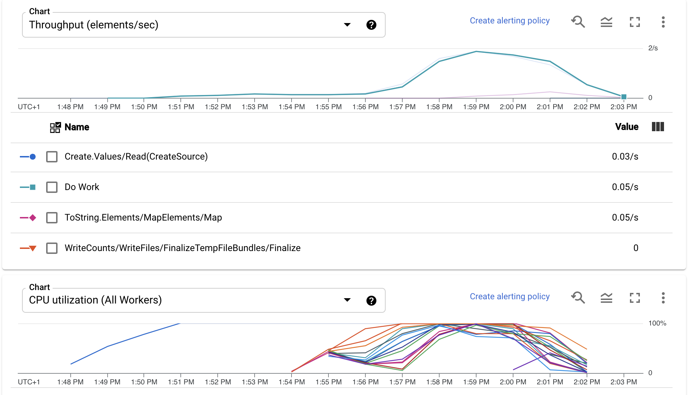

# Dataflow Getting Started

* Created using the following command from this [guide](https://beam.apache.org/get-started/quickstart-java/)
* sample.txt created from [https://www.lipsum.com/](https://www.lipsum.com/)

```bash
mvn archetype:generate \
      -DarchetypeGroupId=org.apache.beam \
      -DarchetypeArtifactId=beam-sdks-java-maven-archetypes-examples \
      -DarchetypeVersion=2.30.0 \
      -DgroupId=org.example \
      -DartifactId=word-count-beam \
      -Dversion="0.1" \
      -Dpackage=org.apache.beam.examples \
      -DinteractiveMode=false
```

# Run Word Count With
Word count is directly from the example found [here](https://beam.apache.org/get-started/quickstart-java/)

```bash
mvn compile exec:java -Dexec.mainClass=org.apache.beam.examples.WordCount \
     -Dexec.args="--inputFile=sample.txt --output=counts" -Pdirect-runner
```

# Hello World
This is a simple pipeline that generates a random number multiple times to generate load to test Dataflow autoscaling:



**local**
```bash
mvn compile exec:java -Dexec.mainClass=org.apache.beam.examples.HelloWorld \
     -Dexec.args="" -Pdirect-runner
```

**gcp**
```bash
export PROJECT_ID=$(gcloud config get-value project)
mvn -Pdataflow-runner compile exec:java \
    -Dexec.mainClass=org.apache.beam.examples.HelloWorld \
    -Dexec.args="--project=$PROJECT_ID \
    --runner=DataflowRunner"
```
